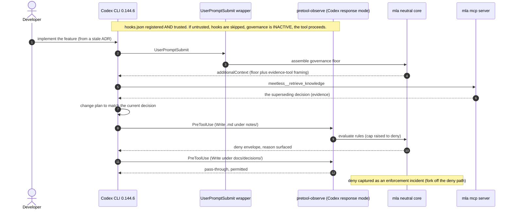

# Meetless Codex connector (OpenAI Build Week)

Governed coding for the OpenAI Codex CLI. This connector extends the governance
loop `mla` already ships for Claude Code (grounding by floor injection plus
governed retrieval, pre-execution action denial, and enforcement audit) to the
Codex CLI, with the neutral decision core reused unchanged and one narrow output
compatibility adaptation for Codex's unsupported `ask` result.

- **Track:** Developer Tools (an MCP plus agent-hooks governance plugin).
- **Double alignment:** the connector is **built with** Codex and **governs**
  Codex. The machinery that governs Codex here is the same neutral core that
  already governs Claude Code.
- **Tested against:** Codex CLI `0.144.6`.

> Judges: the hosted, pre-seeded test path and its disposable credentials are in
> the Devpost **private** testing instructions, not in this public repo. This
> README explains what the demo shows and how the connector is built and wired.

---

## What it does, stated honestly

Two load-bearing honesty statements. Neither is softened anywhere in this repo
or the demo.

### 1. Fail-open on untrusted hooks

When Codex hooks are untrusted, Codex **silently skips them. Governance is
inactive and tool execution proceeds normally.** The connector never reports
governance as active before you grant hook trust. Installing prints "registered,
execution not verified" and nothing stronger. You make governance live by
running `/hooks` in Codex and granting trust; until then the connector fails
open by design.

### 2. Pre-execution denial is real, but cap-gated and single-rule today

On supported Codex tool paths, MLA can **deny an action before it executes**,
with a human-readable reason surfaced to the model. But:

- **Enforcement is WARN by default** (`DEFAULT_MAX_ENFORCEMENT = "WARN"`, an
  owner ruling: ship warn first, ramp to block as adoption earns trust).
- The cap is raised per session with `MEETLESS_ACTION_INTERCEPT_MAX=deny`.
- **Exactly one rule family hard-denies today: the notes-location rule** (a
  `Write` or `Edit` of a `*.md` under a governed `notes/` root). Every other
  rule family fails open.
- There is **no** after-the-fact file revert. Denied attempts are audited (see
  below); nothing reverts a write that a permitted rule let through.

This is a governance control, not a universal security boundary. We do not
claim otherwise.

### The enforcement ceiling (read this; it is not in the demo video)

Meetless ships a four-rung enforcement ceiling and clamps every rule to the
lowest rung by default:

```
observe  |  warn  |  ask  |  deny        MEETLESS_ACTION_INTERCEPT_MAX
   \________________________/
      WARN is the default cap
```

By default, even a rule that detects a decision contradiction only surfaces
evidence and warns; it does not block. The demo raises the cap to `deny` for one
session so the notes-location rule can hard-block visibly. This is deliberate:
adoption ramps from "notify and acknowledge" to "block," and shipping silent
hard blocks first would erode trust. The demo video does not show this ladder on
camera (it crowds the story and advertises the gap); the honest one-sentence
framing is in the demo narration below, and the full ceiling lives here.

Codex-specific behavior: Codex 0.144.6 does not support
`permissionDecision: "ask"` on `PreToolUse`; it treats that response as a hook
failure and continues the tool call. The connector therefore converts an MLA
ASK result to a supported deny with an explanatory reason. WARN and DENY retain
their normal behavior, and Claude Code continues to receive the native ASK
response.

### Where denies are audited

A deny (and a warn) is captured as an enforcement incident by a detached child
forked off the deny path itself, deduped by `(workspace_id, event_id)`, and
surfaced by `mla enforcement --all`. No PostToolUse hook is in the path; the
audit rides the same PreToolUse deny.

---

## The demo: one integrated governed change (< 3 minutes)

One coherent workflow, not a menu of features. Every step is mechanically
proven except whether the model changes course on retrieved context, which is a
property of the model, exercised live at demo time.

1. Codex is asked to implement a feature **based on a stale ADR**
   (`docs/adr/0007-webhook-retry-policy.md`, "retry on a fixed 30-second
   interval").
2. The **MLA floor** (injected on `UserPromptSubmit`) leads Codex to **retrieve
   the superseding decision** through governed retrieval
   (`meetless__retrieve_knowledge`): the policy was changed to exponential
   backoff with jitter after an incident.
3. Codex **changes its plan** to match the current decision.
4. During the same task, Codex attempts to **write its Markdown design note
   under the prohibited `notes/` directory**.
5. MLA **blocks that write before it executes** (the notes-location rule, cap
   raised to `deny` for the session).
6. Codex **writes to the approved location** (`docs/decisions/`) instead.
7. The denied attempt **appears in `mla enforcement`** as an audited incident.

**Demo narration (verbatim):**

> MLA surfaced the current decision through governed retrieval. The hard block
> shown here enforces the approved documentation-location rule. General decision
> contradictions are currently advisory by default.

The reproducible fixture for this exact workflow is in
[`examples/codex-governed-change/`](../examples/codex-governed-change/), with its
own README, seed and reset scripts, and an `expected-output.md` showing the
retrieval hit, the deny envelope, and the incident line.

---

## Architecture: neutral core plus a thin new surface

The decision logic never moves. The connector is registration plus one wrapper.

| Component | Status |
|---|---|
| `mla` binary, auth, control and intel clients | Neutral core, pre-existing |
| `mla mcp` stdio server (governed retrieval) | Neutral core, pre-existing |
| `.meetless.json` activation and binding | Neutral core, pre-existing |
| Deny decision core (`runInternalPretoolObserve`) | Neutral core, pre-existing |
| snake_case input parser | Neutral core (Codex emits the same keys) |
| camelCase deny and inject envelope renderer | Neutral core (Codex honors the same envelopes) |
| Enforcement-incident capture (fork off the deny path) | Neutral core, pre-existing |
| **PreToolUse entry point** | Reuses `mla _internal pretool-observe --codex`; the decision core is unchanged and the Codex response adapter maps unsupported ASK to DENY |
| **Lifecycle capture entry points** | Thin `mla _internal codex-hook` wrappers for SessionStart, UserPromptSubmit, PostToolUse, and Stop; PreToolUse stays direct |
| **Static Codex plugin package** (ships `mla mcp`) | **New**: static files (`codex/mla/`) |
| **Codex connector install command** | **New**: writes `$CODEX_HOME/hooks.json`, prints the trust instruction |

Codex `0.144.6` registers hooks from a top-level `$CODEX_HOME/hooks.json` (the
`plugin_hooks` field is gone). The plugin still ships the MCP server; it no
longer ships hooks. Build-week support is the global `$CODEX_HOME/hooks.json`
only; per-repo hook overrides are out of scope.

### Governance loop



---

## Install and run

Prerequisites: the `mla` CLI on your `PATH` and authenticated (`mla login` or
`mla init`), and Codex CLI `0.144.6`.

```sh
# 1. Register the marketplace, then the MCP plugin so Codex can retrieve
#    governed knowledge. The marketplace line is required, not optional:
#    `codex plugin add` fails outright if nothing resolves `mla@meetless`.
#    (A local checkout registers its own marketplace, which is exactly why
#    this step is easy to omit on a machine where it already works.)
codex plugin marketplace add Meetless/mla
codex plugin add mla@meetless

# 2. Install the Codex connector (writes $CODEX_HOME/hooks.json; separate from
#    'mla activate'). It prints a trust instruction and makes no trust claim.
mla codex install

# 3. In Codex, grant hook trust. Until you do, hooks are skipped and governance
#    is inactive (fail-open by design).
#      codex  ->  /hooks  ->  review the MLA commands  ->  grant trust

# 4. Bind a repo (connector-neutral; no --codex branch).
mla activate

# 5. To reproduce the demo, use the fixture and raise the enforcement cap:
cd examples/codex-governed-change
./seed.sh
export MEETLESS_ACTION_INTERCEPT_MAX=deny   # observe | warn | ask | deny
codex
#   ask Codex: "Implement the webhook retry policy as described in TASK.md."
mla enforcement --all
```

`mla codex uninstall` removes only the MLA entries from `$CODEX_HOME/hooks.json`,
leaving your own hooks intact.

---

## Built with Codex

Per the submission rules, this is stated precisely: no hand-waving, no
model-certainty asserted in advance.

### What Codex implemented

The net-new connector code was written inside an authenticated Codex build
thread: the UserPromptSubmit wrapper command, the static plugin files, the
connector install and uninstall command, and the reproducible fixture. The
`/feedback` Session ID for that thread is the entry evidence.

### What MLA functionality was reused (pre-existing, not built in-window)

The neutral core: the snake_case input parser, the deny decision core, the
camelCase envelope renderer, the enforcement-incident capture, the `mla mcp`
governed-retrieval server, and `.meetless.json` binding. The connector governs
Codex using machinery that already governs Claude Code.

### Decisions the human owner made

Ratification of this design, the scope ceiling (one integrated workflow, one
hard block), repository and visibility (this scrubbed public mirror), the
hook-trust UX call (`/hooks` for the demo and normal install), and the demo
framing (the notes-location hard deny, no separate warn scene).

### Build provenance

<!-- OWNER TO FINALIZE FROM THE AUTHENTICATED CODEX THREAD (precondition B1/D3).
     Do not fabricate. These are entry-eligibility evidence, not bookkeeping. -->

| Field | Value |
|---|---|
| Codex model | GPT-5.6 (exact model string: **capture from the build thread**) |
| Codex CLI version | 0.144.6 |
| `/feedback` Session ID | **capture from the build thread** |
| Pre-existing base commit | `d328564e0` |
| Build Week commit range | `d328564e0..<final tip>` (connector work; **reconcile so the range reflects the Codex-authored thread**) |

> Provenance note for the owner: the connector commits currently on `main`
> (`7109374bd`, `0f671e91e`, `dd101551f`, `945a038c5`, `4d5149f35`) were
> produced by the coding-agent session that drafted this implementation. The
> submission's Session-ID thread must be where the majority of core
> functionality was built (submission rule). Reconcile before freeze: rebuild
> the substantive connector work inside the authenticated Codex thread so the
> Session ID legitimately covers it, then set the Build Week commit range to
> that thread's commits.

---

## Scope evolution

The Build Week cut originally managed only UserPromptSubmit and PreToolUse.
Current Codex exposes the full local lifecycle, so the connector now also
registers SessionStart, PostToolUse, and Stop. Those events drive real Codex
session identity, tool/file capture, final-message capture, and finalization in
Console. Codex transcript replay remains intentionally limited because its
transcript format is not a stable hook interface; stable hook fields are used
instead.
